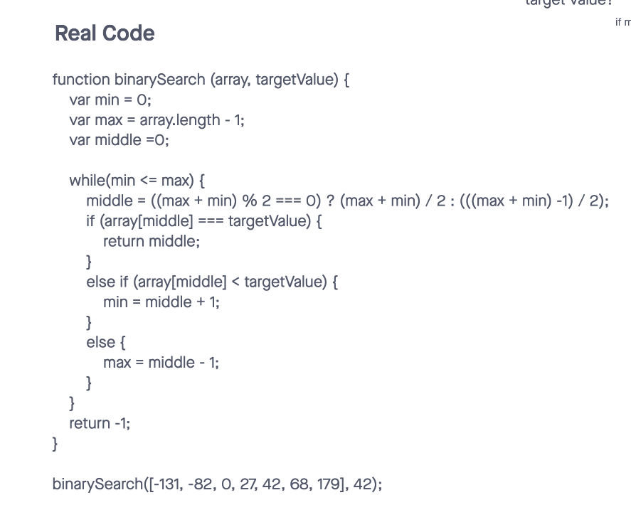
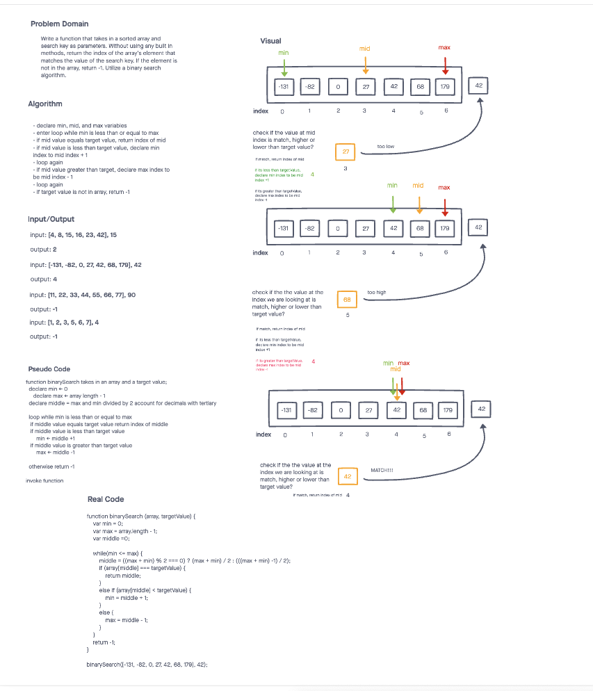

# Array Binary Search

This code challenge includes a function that takes in a sorted array and search key as parameters. Without using any built in methods, return the index of the array's element that matches the value of the search key. If the element is not in the array, return -1. Utilize a binary search algorithm.

## Inputs / Outputs

Input: `[4, 8, 15, 16, 23, 42], 15`  
Output: `2`

Input: `[-131, -82, 0, 27, 42, 68, 179], 42`  
Output: `4`

Input: `[11, 22, 33, 44, 55, 66, 77], 90`  
Output: `-1`

Input: `[1, 2, 3, 5, 6, 7], 4`  
Output: `-1`

## Algorithm

- declare min, mid, and max variables
- enter loop while min is less than or equal to max
- if mid value equals target value, return index of mid
- if mid value is less than target value, declare min index to mid index + 1
- loop again
- if mid value greater than target, declare max index to be mid index - 1
- loop again
- if target value is not in array, return -1

## Pseudocode

```plaintext

function binarySearch takes in an array and a target value
  declare min <- 0
  declare max <- array length - 1
  declare middle = max and min divided by 2 account for decimals with tertiary

  loop while min is less than or equal to max
    if middle value equals target value return index of middle
    if middle value is less than target value
      min <- middle +1 
    if middle value is greater than target value
      max <- middle -1
  otherwise return -1

invoke function 
```

## Whiteboard




