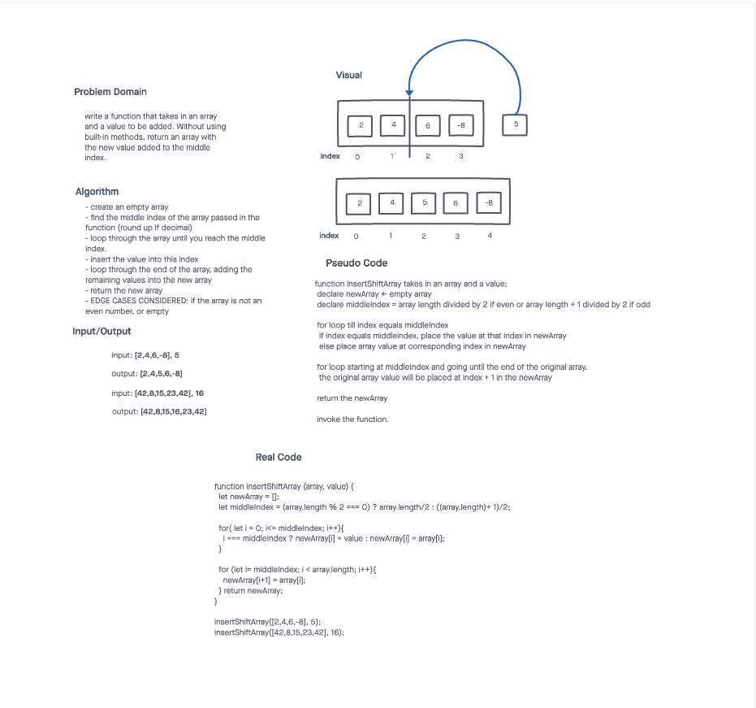

# Array Insert Shift

This code challenge includes a function that takes in an array and a value to be added. Without using built-in methods, it returns an array with the new value added to the middle index.

## Inputs / Outputs

Input: `[2,4,6,-8], 5`  
Output: `[2,4,5,6,-8]`

Input: `[42,8,15,23,42], 16`  
Output: `[42,8,15,16,23,42]`

## Algorithm

- create an empty array

- find the middle index of the array passed in the function (round up if decimal)

- loop through the array until you reach the middle index.

- insert the value into this index

- loop through the end of the array, adding the remaining values into the new array

- return the new array

- EDGE CASES CONSIDERED: if the array is not an even number, or empty

## Pseudocode

```plaintext

function insertShiftArray takes in an array and a value;
  declare newArray <- empty array
  declare middleIndex = array length divided by 2 if even or array length + 1 divided by 2 if odd 

  for loop till index equals middleIndex
    if index equals middleindex, place the value at that index in newArray
    else place array value at corresponding index in newArray

  for loop starting at middleIndex and going until the end of the original array
    the original array value will be placed at index + 1 in the newArray

  return the newArray

  invoke the function.

```

## Whiteboard




