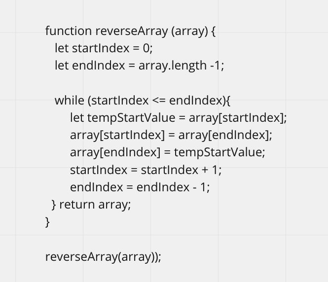
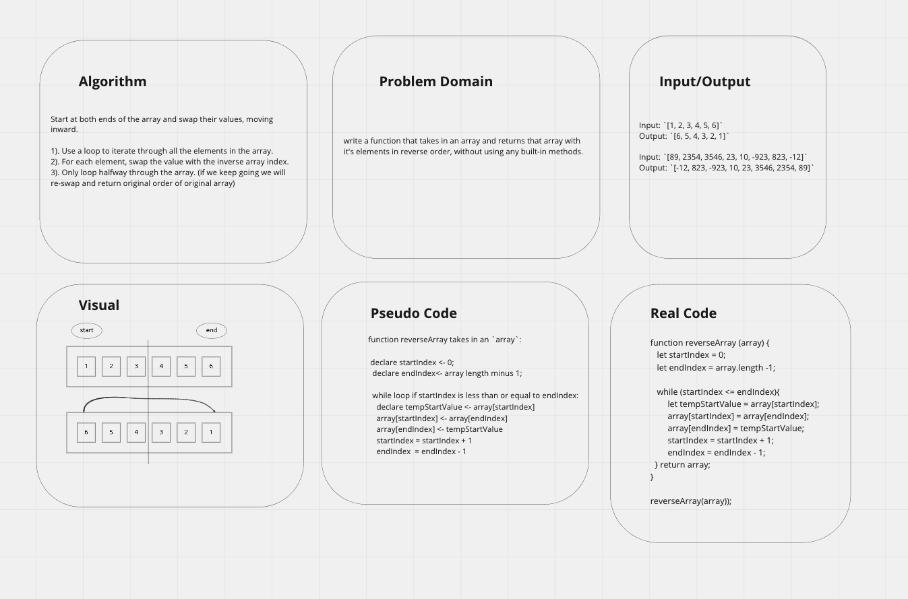

# Reverse Array

This code challenge includes a function that takes in an array and returns that array with it's elements in reverse order, without using any built-in methods.

## Inputs / Outputs

Input: `[1, 2, 3, 4, 5, 6]`  
Output: `[6, 5, 4, 3, 2, 1]`

Input: `[89, 2354, 3546, 23, 10, -923, 823, -12]`  
Output: `[-12, 823, -923, 10, 23, 3546, 2354, 89]`

## Algorithm

Start at both ends of the array and swap their values, moving inward.

1). Use a loop to iterate through all the elements in the array.  
2). For each element, swap the value with the inverse array index.  
3). Only loop halfway through the array. (if we keep going we will re-swap and return original order of original array)  

## Pseudocode

```plaintext

function reverseArray takes in an `array`:

  declare startIndex <- 0;
  declare endIndex<- array length minus 1;

  while loop if startIndex is less than or equal to endIndex:
    declare tempStartValue <- array[startIndex] 
    array[startIndex] <- array[endIndex]
    array[endIndex] <- tempStartValue
    startIndex = startIndex + 1
    endIndex  = endIndex - 1

```

## Whiteboard





