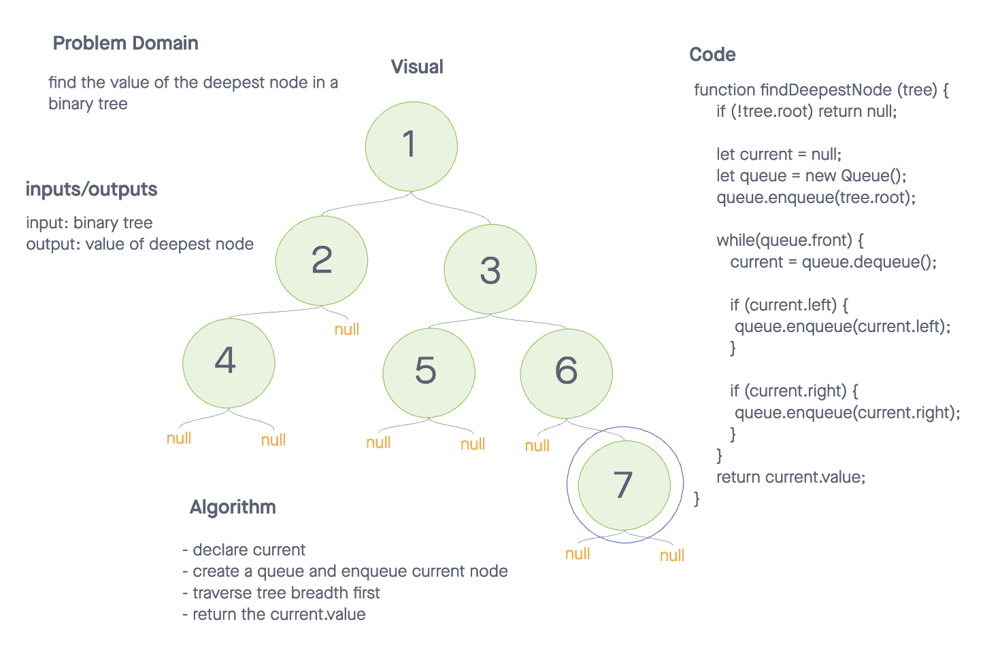

# Find The Deepest Node Of A Binary Tree.

## Problem Domain

Find the value of the deepest node in a binary tree. If multiple nodes exist at the deepest level, return the rightmost node. 

## Inputs / Outputs

Input: `binary tree`
Output: `value of the deepest node`

## Algorithm

- if root does not exist, return null

- declare current variable

- create a queue and enqueue the root

- implement breadth first traversal 

  - loop while queue.front exists

  - dequeue and set current variable equal to the node dequeued

  - if the current node has a left property, enqueue it

  - if the current node has a right property, enqueue it

- after breaking out of while loop, return the current node value as breadth first traversal will end on the rightmost, deepest node in a binary tree

## Efficiency

**time complexity: O(n)**
Breadth first traversal, requires us to touch every node in the tree, making the time complexity O(n) where n is the number of nodes in the tree.
 
**Space complexity: O(n)**
Breadth first traversal, requires us to store at least an entire level of the tree in the queue. Worst case, we may need to hold all the nodes in the queue, making the space complexity O(n) where n is the number of nodes in the tree.

## Whiteboard

  

## Solution Code

[Find the Deepest Node](./deepest-node.js)  

## Tests

[Deepest Node Tests](./__tests__/deepest-node.test.js)  
 
