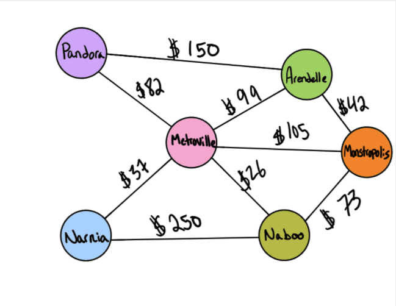

# Graph-Business-Trip (find edges)

## Problem Domain
 Given a business trip itinerary, and an Alaska Airlines route map, is the trip possible with direct flights? If so, how much will the total trip cost be? Determine whether the trip is possible with direct flights, and how much it would cost.

## Inputs / Outputs

input: graph, array of city names
return: cost or null

input: [Metroville, Pandora, ]
return: True, $82

input: [Arendelle, New Monstropolis, Naboo]
return: True, $115

input: [Naboo, Pandora]
return: False, $0

input: [Narnia, Arendelle, Naboo]
return: False, $0

## Algorithm

- declare starting price at 0

- get all the vertices of the graph

- loop through the city name array

  - check the adjacency table to see if the city name exists in the trip graph

  - if not return false and current price

  - If it does, add to the price (edge weight)

- Continue looping through city array until you reach the end

- return true and total price

## Efficiency

Time complexity: O(V)
Space complexity: O(V^2) where V is the number of vertices

## Solution Code

[index.js](./index.js)

## Tests

[Test Suite](./__tests__/trip.test.js)