# Insertion-Sort

Insertion Sort is a function that takes in an unsorted array and sorts it in ascending order. It traverses through the array comparing the current element's value to the previous element, moving the current element in front of the previous element if it's value is smaller. It continues through the entire array until the end is reached.

## Algorithm

1). Iterate through the array beginning at index 1 until you reach the end of the array.

2). At each iteration, compare the current element to the element before it.

3). If the current element is smaller than the element before it, compare it to the element before that one. Continuing on until you find an element it is greater than.

4). Move the elements that are greater than current element to the right in the array (one position up) to make space for the swapped current element.

## Pseudocode

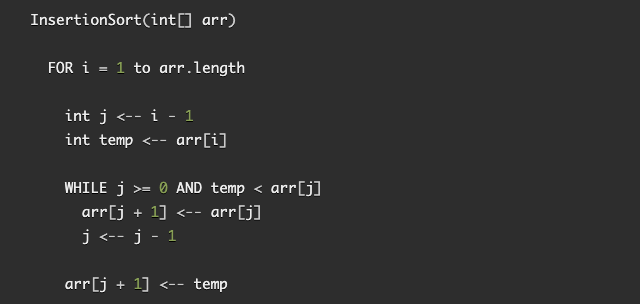

## Steps

*sample input array*

`[8,4,23,42,16,15]`

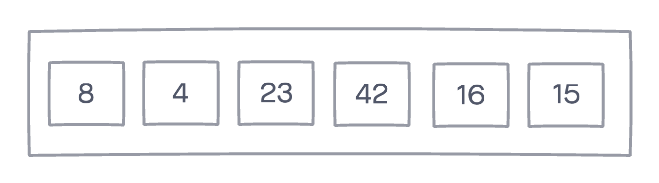

### Pass 1

```
for loop iteration: 1
previousIndex: 0
currentValue: 4
total while loop iterations: 1
```

The first pass through you enter the for loop starting at index 1. 

Since the current value (4) is less than the previous index value (8), you enter the while loop. 

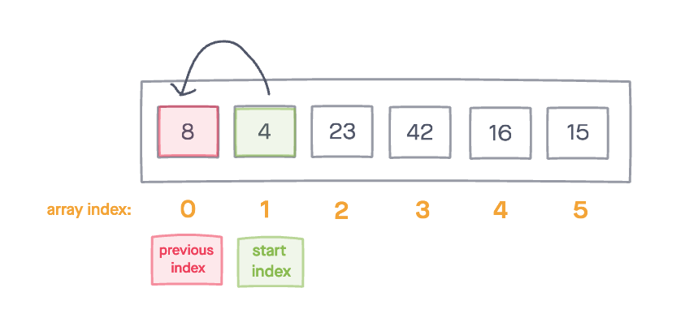

You set the current index value to equal the array at the previous index value. 

Increment the previous index until you hit the front of the array or until current value is greater than previous, breaking out of the while loop. 

Once, out of the while loop, set the currentValue to the  previousIndex + 1 to finish the swap. 

**Result of Pass 1**

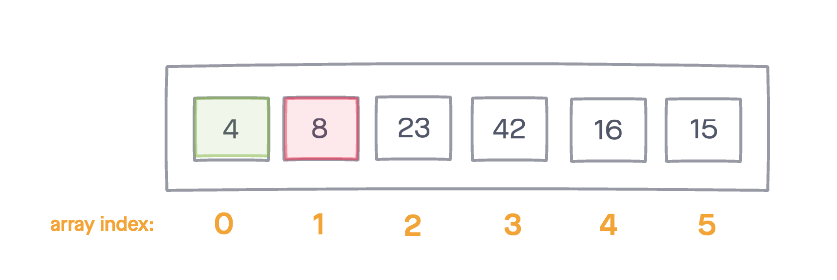


### Pass 2

```
for loop iteration: 2
previousIndex: 1
currentValue: 23
total while loop iterations: 0
```

In the second pass, you enter the for loop starting at index 2. 

Since the current value (23) is greater than the previous index value (8), you DO NOT enter the while loop. 

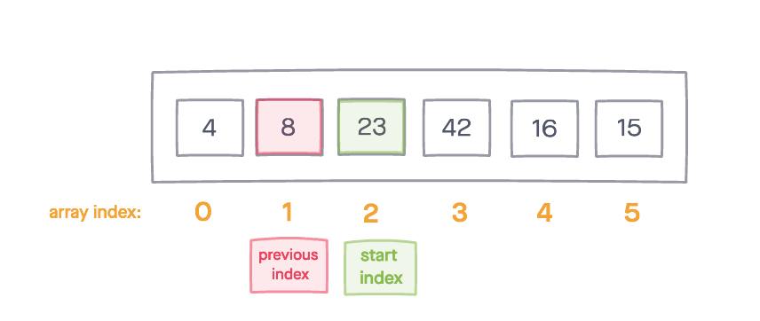

**Result of Pass 2**

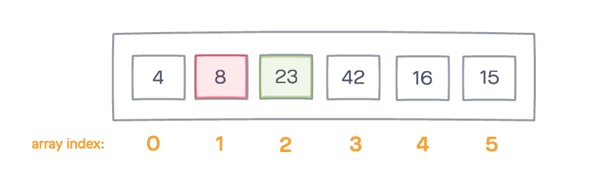

### Pass 3

```
for loop iteration: 3
previousIndex: 2
currentValue: 42
total while loop iterations: 0
```

In the third pass, you enter the for loop starting at index 3. 

Since the current value (42) is greater than the previous index value (23), you enter the while loop. 

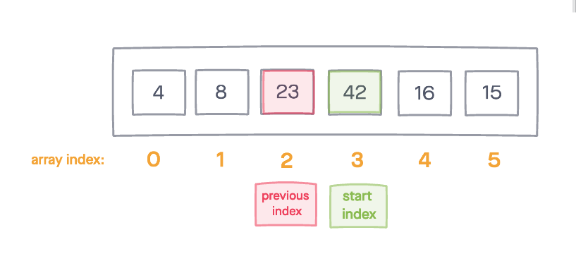

**Result of Pass 3**

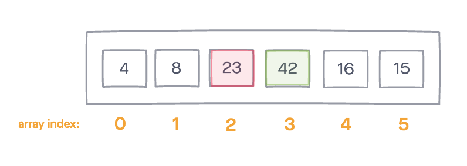


### Pass 4

```
for loop iteration: 4
previousIndex: 3
currentValue: 16
total while loop iterations: 2

```

In the fourth pass, you enter the for loop starting at index 4. 

Since the current value (16) is less than the previous index value (42), you enter the while loop. 


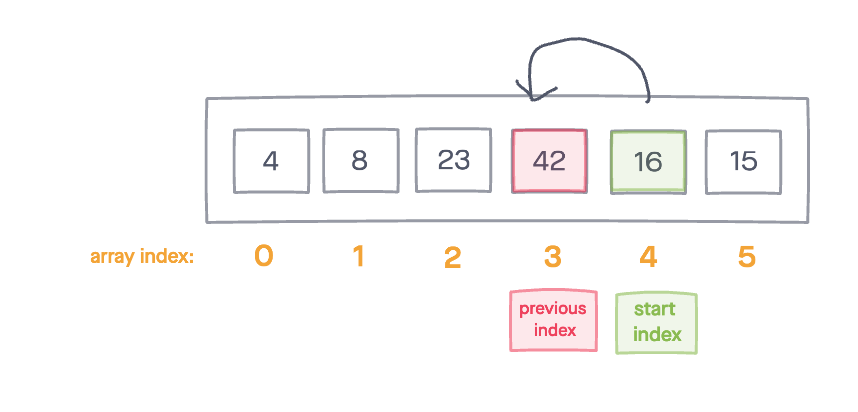

You set the current index value to equal the array at the previous index value. 

Increment the previous index until you hit the front of the array or until current value is greater than previous, breaking out of the while loop. 

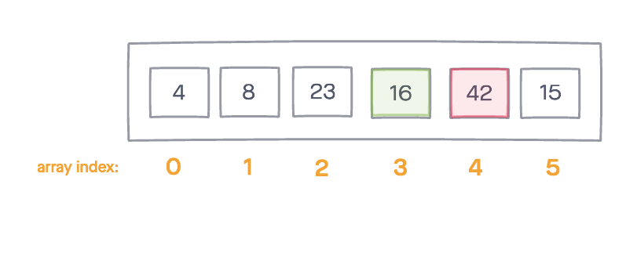

Since 16 is still less than 23, you continue in the while loop again. 

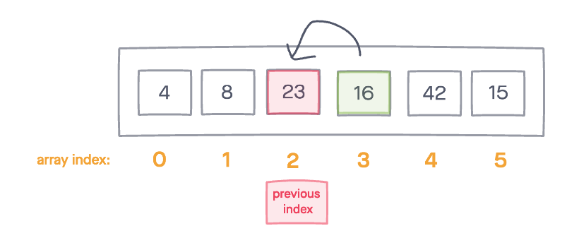

16 is greater than 8, breaking us out of the while loop. 

Once, out of the while loop, set the currentValue to the  previousIndex + 1 to finish the swap. 

**Result of Pass 4**

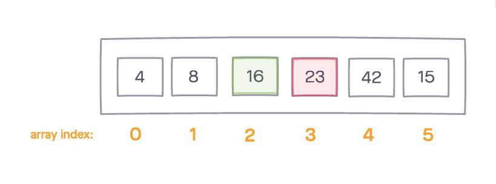

### Pass 5

```
for loop iteration: 5
previousIndex: 4
currentValue: 15
total while loop iterations: 3
```

In the fifth pass, you enter the for loop starting at index 5. 

Since the current value (15) is less than the previous index value (42), you enter the while loop. 

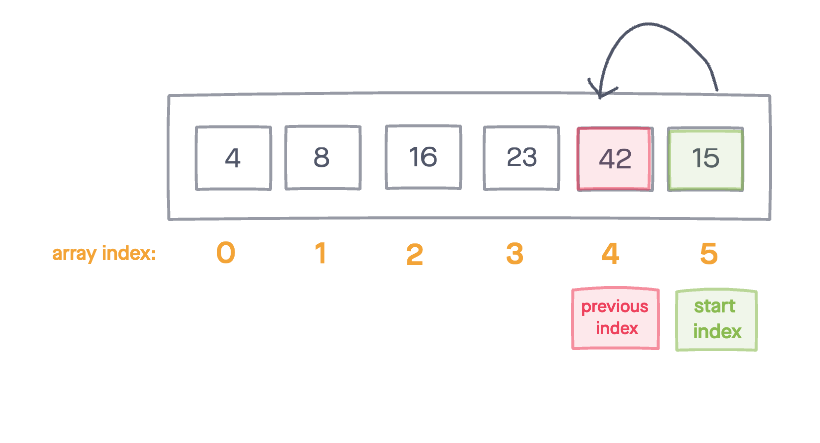

You set the current index value to equal the array at the previous index value. 

Increment the previous index until you hit the front of the array or until current value is greater than previous, breaking out of the while loop. 

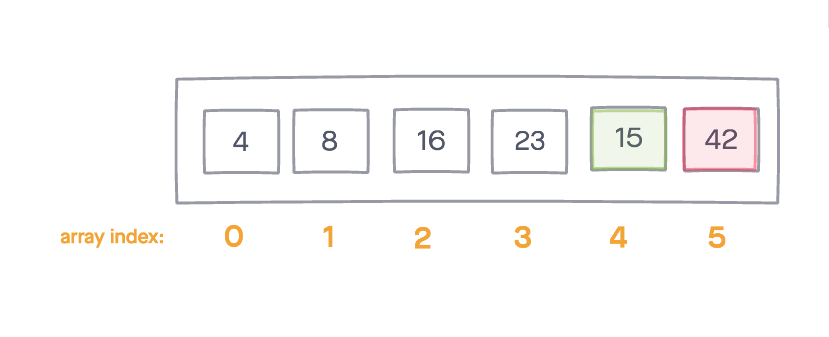

Since 15 is less than 23, you continue in the while loop. 

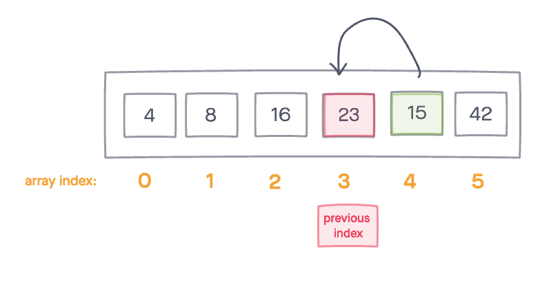

Since 15 is less than 16, you continue in the while loop. 

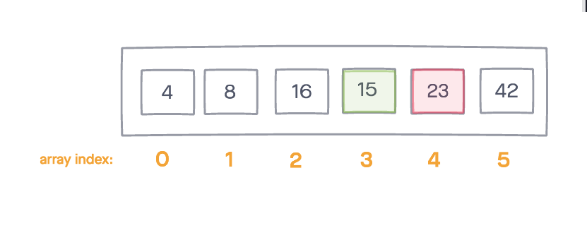

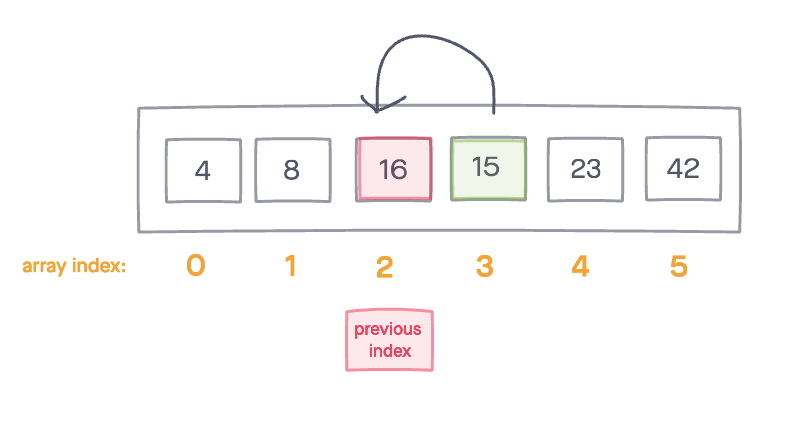

15 is greater than 8, breaking us out of the while loop. 

Once, out of the while loop, set the currentValue to the  previousIndex + 1 to finish the swap. 

**Result of Pass 5**

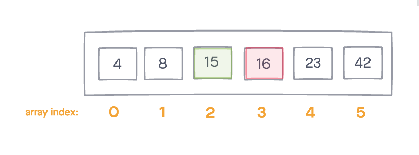


## Efficency

**Time: O(n^2)**

**Space: O(1)**

