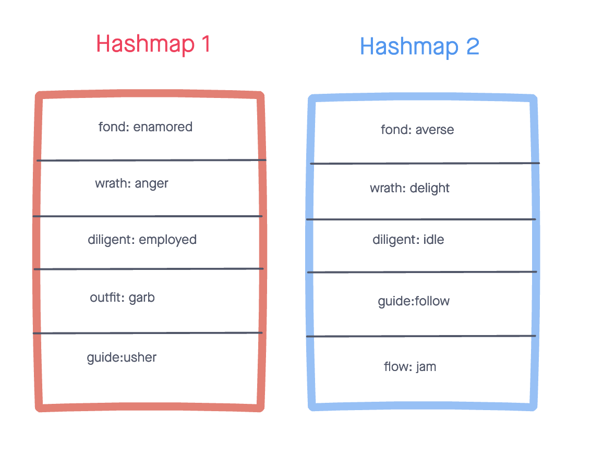

# Left-Join 2 Hashmaps

## Problem Domain
Write a function that LEFT JOINs two hashmaps into a single data structure. This function takes in two hash maps as arguments. The first parameter is a hashmap that has word strings as keys, and a synonym of the key as values. The second parameter is a hashmap that has word strings as keys, and antonyms of the key as values. This function returns an array of objects that holds the word, synonym, and antonym properties. 

## Inputs / Outputs

Input: 2 hash maps



Output: 

```JS
[
  { word: 'fond', synonym: 'enamored', antonym: 'averse' },
  { word: 'wrath', synonym: 'enamored', antonym: 'delight' },
  { word: 'diligent', synonym: 'employed', antonym: 'idle' },
  { word: 'outfit', synonym: 'garb', antonym: null },
  { word: 'guide', synonym: 'usher', antonym: 'follow' }
]
```

## Algorithm

- declare an empty array

- search through each key in the first hash map

- for each key, push an object into the array containing the word, the synonym and the atonym if present

- use built in hashmap .get method to obtain the values associated with each key

- return the words array

## Efficiency

Time complexity: O(n) because we traverse through the first hash map one time

Space complexity: O(n) because we are creating an array of objects that could potentially be n long

## Solution Code

[index.js](./index.js)


## Tests

[Test Suite](./__tests__/left-join.test.js)