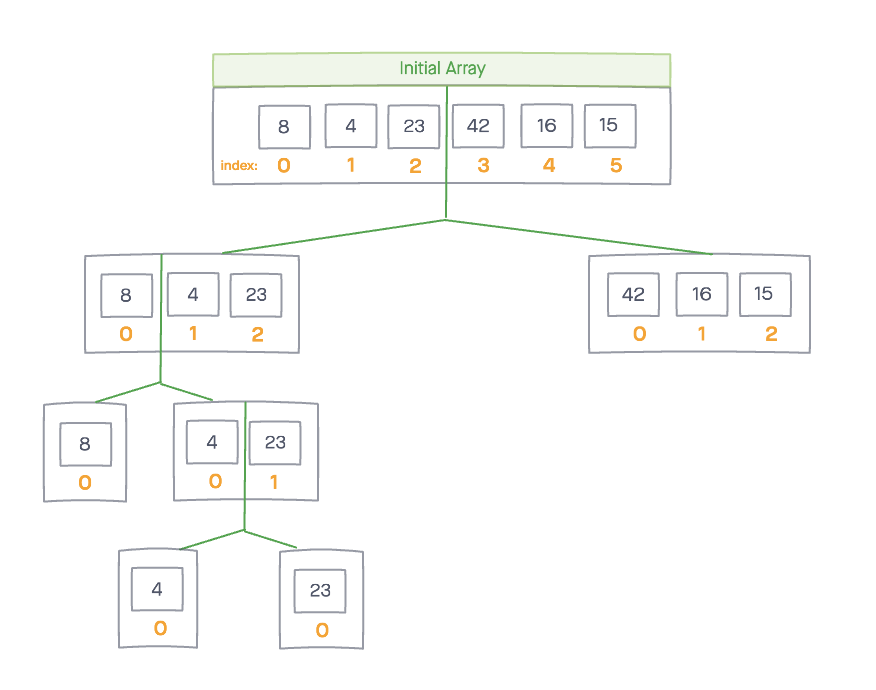
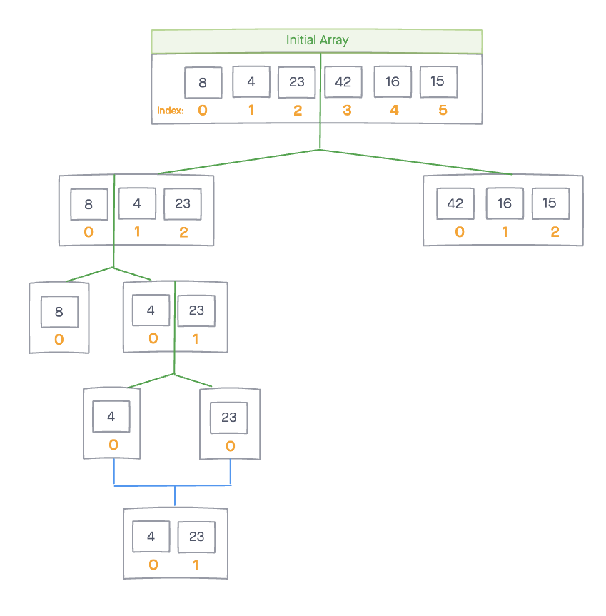
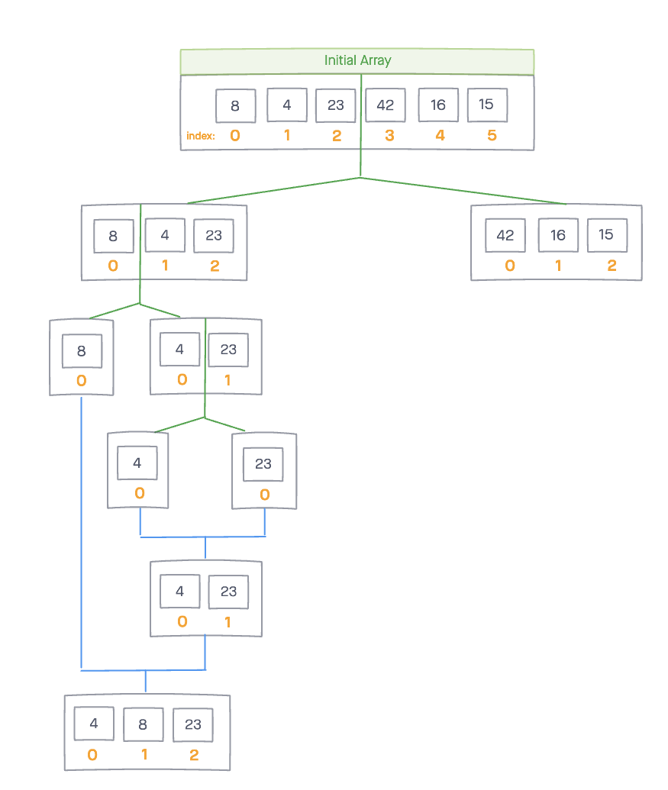

# Merge-Sort

Merge Sort is a function that takes in an unsorted array and splits it in half until each subarray contains one element. Then, it merges the subarrays back together, in ascending order until a final sorted array is reached.

## Algorithm

1). Split the iput array into two halves. 

2). Continue splitting the subarrays in half until the subarrays contain only one element.

3). Now, begin merging the single element subarrays with one another in acsending order.

4). Repeat step 3 until all subarrays have been merged into one final array.

## Pseudocode


## Steps

*sample input array*

`[8,4,23,42,16,15]`


### Step 1

Split the intial array into two subarrays using the middle index. 

```
mid 3
left [ 8, 4, 23 ]
right [ 42, 16, 15 ]
```


Continue splitting the subarray using the middle index. 

```
mid 1
left [ 8 ]
right [ 4, 23 ]
```


Split the subarray again. Now each subarray has a length of 1 and cannot be split any further. 

```
mid 1
left [ 4 ]
right [ 23 ]
```




Now we break into merge function and begin merging the left side. 





Once the left side is merged, we hop over to the right side to split the right array into subarrays. 

```
mid 1
left [ 42 ]
right [ 16, 15 ]
```


Continue splitting the subarray using the middle index. 

```
mid 1
left [ 16 ]
right [ 15 ]
```


Now we break into merge function and begin merging the right side.


Continue merging. 


Once the right side is merged, we merge with the left side to receive the final array in sorted order. 


## Efficency

**Time: O(nlogn)**

**Space: O(n)**

