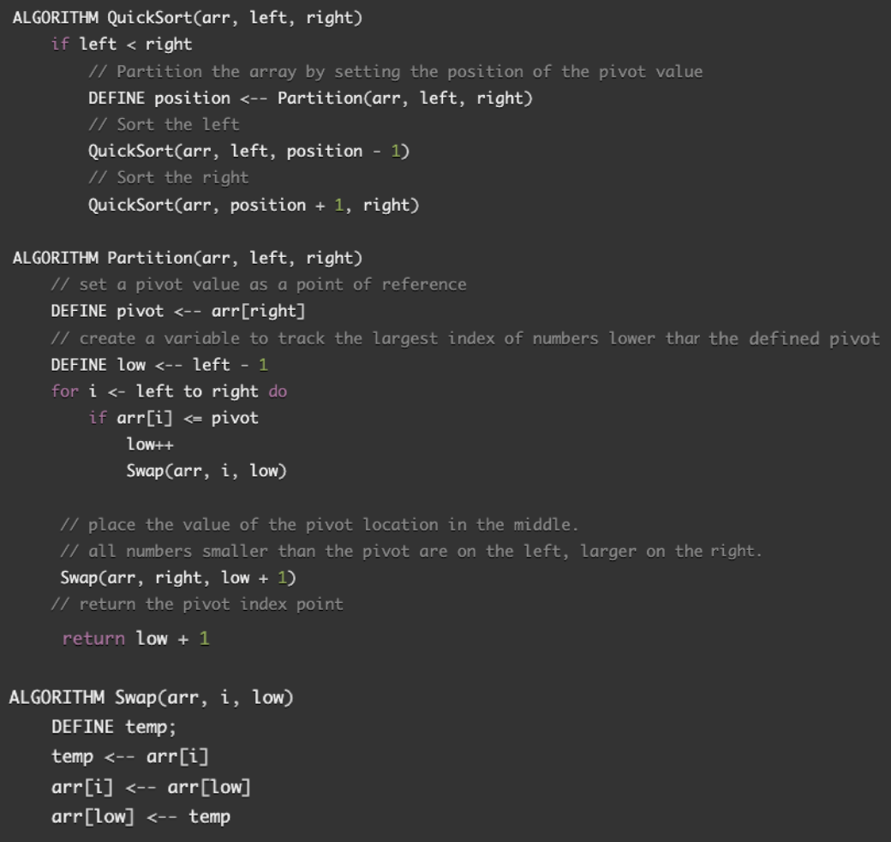
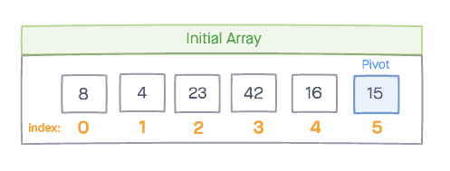
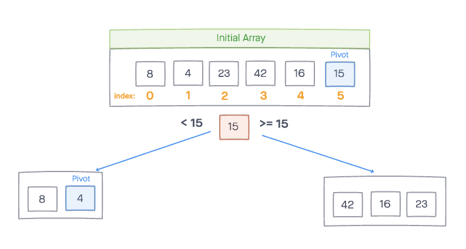
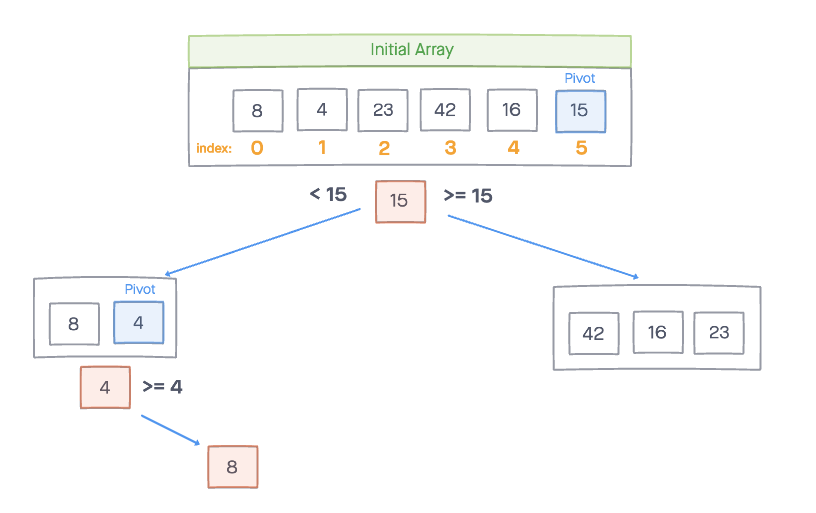
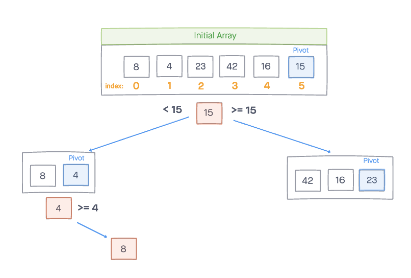
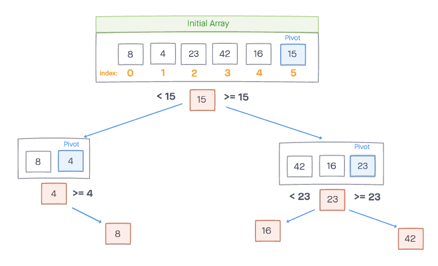
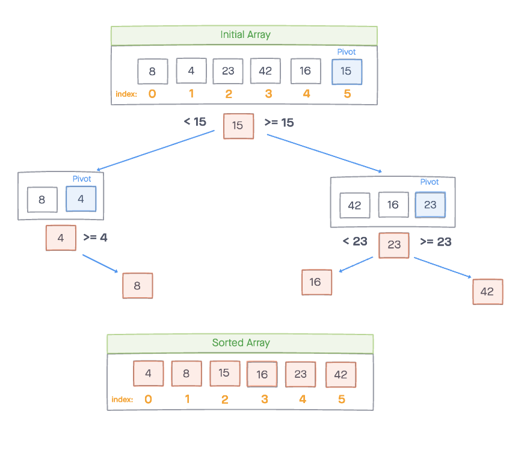

# Quick-Sort Recursive Method

Quick Sort is a function that takes in an unsorted array and sorts it in ascending order, by dividing the array into subarrays, using a pivot value to determine whether elements should be sorted to the left or right subarray.

## Algorithm

1). Select a pivot element in the array. In this example, we'll use the last element in the array.

2). Sort the elements of the array. Elements to the left of the pivot are smaller than the pivot and  elements to the right are greater than the pivot. This process is called partitioning. If an element is equal, it will go to the right.

3). Repeat this process for the left and right side of the pivot, until the array is sorted.

## Pseudocode

## Steps

*sample input array*

`[8,4,23,42,16,15]`

To begin, set the last element in the array as the pivot. 

Set the variable pivotIndex to help us track of the "middle" position where we will eventually put the pviot value once the left and right have been sorted. *(to the left are values smaller than the pivotValue and right are values larger than)*

Notice how 23 is at the end of the array now. This is because we swapped it with the pivotValue of 15 because 15 needs to be at index 2 to be in the middle of the left and ride that has been sorted. 

Now 4 is the pivot on our left side and we compare it with the value of 8. Since 8 is larger, 8 and 4 switch and we move to the right. 

23 is now our pivot value on the right side. 

We compare 42 and 16 with 23 and sort them to the right and left respectively. 

Our array has been sorted!

## Efficency

**Time: O(n^2)**

**Space: O(long(n))**

