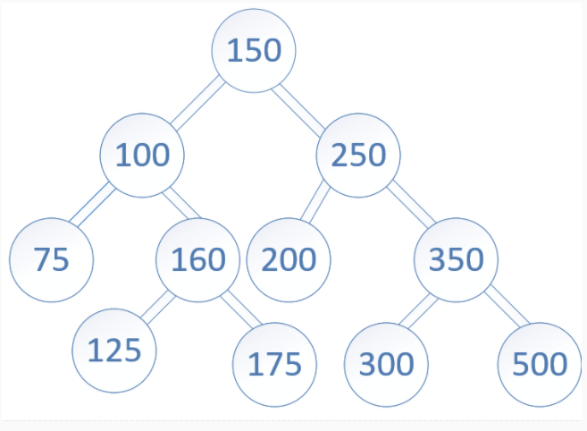
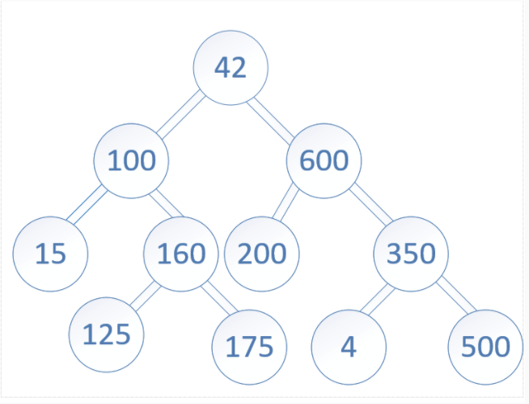
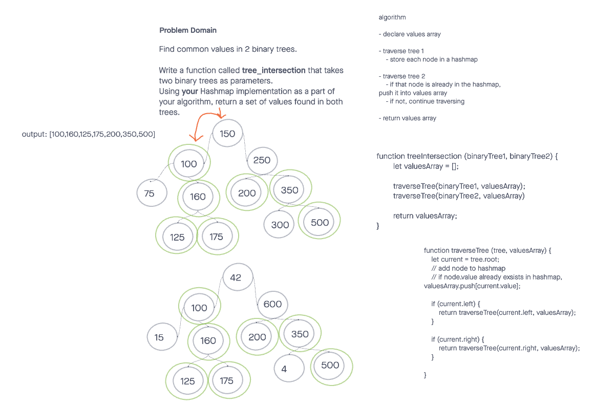

# Tree-Intersection

## Problem Domain
Find common values in 2 binary trees. This function takes in two binary trees as parameters and utilizes a Hashmap implementation to return a set of values found in both trees. Includes testing suite.

## Inputs / Outputs

Input1: 

Input2: 

Output: `[100,160,125,175,200,350,500]`

## Algorithm

- declare values array 

- traverse tree 1, storing each node in a hashmap

- traverse tree 2

- check to see if that node is already in the hashmap, if it is push it into values array

- if not, continue traversing

- return values array

## Efficiency

Time complexity: O(n) we have to traverse both trees entirely to compare all the values. 

Space complexity: O(n) we create a Hashmap that stores all the values in tree1 and a values array that stores all the duplicate values;

## Solution Code

[index.js](./tree-intersection.js)

## Tests

[Test Suite](./__tests__/tree-intersection.test.js)

## Whiteboard

## Future Implementation

I plan to revist this problem and refactor it as I'd like to find a simplier way to solve it. 
